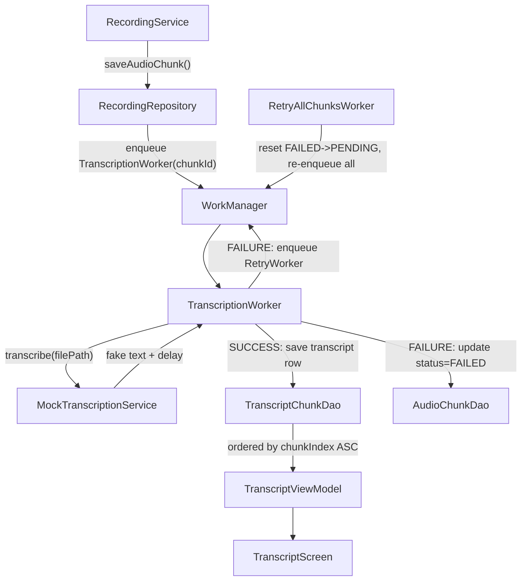

<!--firebender-plan
name: Transcript Feature
overview: Implement automatic transcription of 30-second audio chunks using a mock service, with WorkManager for background processing, Room as single source of truth, correct ordering, and full retry-all-chunks logic on failure.
todos:
  - id: transcript-entity
    content: "Create TranscriptChunkEntity and TranscriptChunkDao"
  - id: db-migration
    content: "Update AppDatabase: add TranscriptChunkEntity, version 2, MIGRATION_1_2"
  - id: transcription-service
    content: "Create TranscriptionService interface and MockTranscriptionService"
  - id: transcription-repo
    content: "Create TranscriptionRepository with enqueue/retry logic"
  - id: transcription-worker
    content: "Create TranscriptionWorker (HiltWorker) and RetryAllChunksWorker"
  - id: recording-repo-update
    content: "Update RecordingRepository to enqueue transcription after saveAudioChunk"
  - id: di-modules
    content: "Update DI modules: provide TranscriptChunkDao, bind MockTranscriptionService"
  - id: transcript-ui
    content: "Create TranscriptViewModel and TranscriptScreen"
  - id: navigation-dashboard
    content: "Wire up navigation and make dashboard cards clickable"
-->

# Transcript Feature Implementation

## Architecture

## New Files

- **`data/db/entity/TranscriptChunkEntity.kt`** — Room entity: `id`, `meetingId`, `chunkId`, `chunkIndex`, `text`, `createdAtMs`
- **`data/db/dao/TranscriptChunkDao.kt`** — `insert()`, `getTranscriptForMeeting(meetingId): Flow<List<...>>` (ORDER BY chunkIndex ASC), `deleteForMeeting(meetingId)`
- **`data/transcription/TranscriptionService.kt`** — Interface with `suspend fun transcribe(filePath: String): String` + `MockTranscriptionService` impl (50-200ms delay, returns "Transcribed text for chunk N…")
- **`worker/TranscriptionWorker.kt`** — HiltWorker; input: `chunkId`; fetch chunk → call service → save transcript or mark FAILED + enqueue retry worker; uses `setExpedited()`
- **`worker/RetryAllChunksWorker.kt`** — HiltWorker; input: `meetingId`; resets all FAILED chunks to PENDING, deletes their transcript rows, re-enqueues a `TranscriptionWorker` per chunk
- **`data/repository/TranscriptionRepository.kt`** — `enqueueChunkTranscription(chunk)`, `retryAllChunks(meetingId)`, `getTranscriptForMeeting(meetingId): Flow<List<TranscriptChunkEntity>>`
- **`ui/transcript/TranscriptViewModel.kt`** — Observes transcript Flow + meeting state; exposes retry action
- **`ui/transcript/TranscriptScreen.kt`** — Simple `LazyColumn` of transcript lines; shows loading spinner per in-progress chunk; shows "Retry All" button when any chunk is FAILED

## Modified Files

- **[`data/db/AppDatabase.kt`](app/src/main/java/com/twinmindx/data/db/AppDatabase.kt)** — Add `TranscriptChunkEntity` to entities list, bump to `version = 2`, add `MIGRATION_1_2` (add `transcript_chunks` table)
- **[`data/repository/RecordingRepository.kt`](app/src/main/java/com/twinmindx/data/repository/RecordingRepository.kt)** — Inject `TranscriptionRepository`; after `saveAudioChunk()` succeeds, call `enqueueChunkTranscription(chunk)` immediately
- **[`di/WorkerModule.kt`](app/src/main/java/com/twinmindx/di/WorkerModule.kt)** or new `TranscriptionModule.kt` — Bind `MockTranscriptionService` to `TranscriptionService` interface
- **[`di/DatabaseModule.kt`](app/src/main/java/com/twinmindx/di/DatabaseModule.kt)** — Provide `TranscriptChunkDao`
- **[`ui/navigation/AppNavigation.kt`](app/src/main/java/com/twinmindx/ui/navigation/AppNavigation.kt)** — Add `transcript/{meetingId}` route
- **[`ui/dashboard/DashboardScreen.kt`](app/src/main/java/com/twinmindx/ui/dashboard/DashboardScreen.kt)** — Make meeting cards clickable to navigate to `TranscriptScreen`

## Key Implementation Details

- **Unique work names**: enqueue each chunk as `"transcription_$chunkId"` with `ExistingWorkPolicy.KEEP` to prevent duplicate workers
- **Retry all**: `RetryAllChunksWorker` uses work name `"retry_all_$meetingId"` with `ExistingWorkPolicy.REPLACE`; it resets chunk statuses in DB and fans out new per-chunk workers
- **Ordering**: `TranscriptChunkDao` always queries `ORDER BY chunkIndex ASC` — guarantees correct transcript order regardless of transcription completion order
- **Don't lose chunks**: Chunks stay in DB with status `FAILED`; no deletion on failure; only `ChunkStatus.DONE` after successful transcript save
- **Mock service**: Returns `"[Chunk $chunkIndex] Mock transcript: Lorem ipsum dolor sit amet..."` after a simulated 100ms delay

## No New Dependencies Needed
WorkManager, Room, Hilt, and Coroutines are already in the project.
